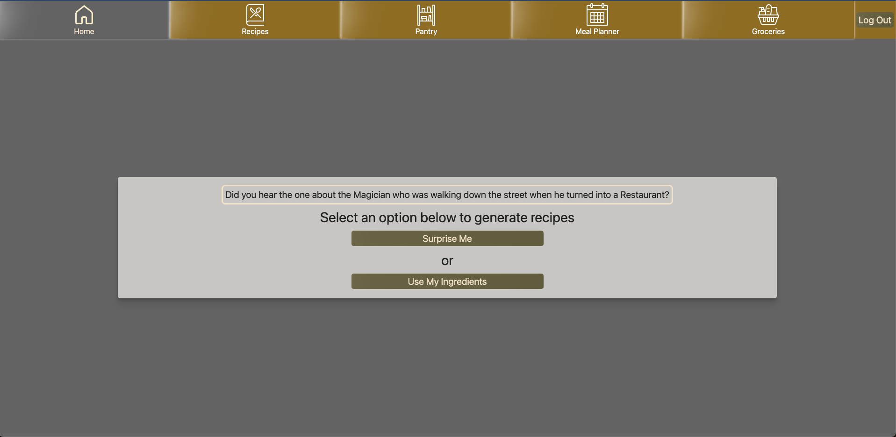

# Whisk

## Preview

Sign Up page:

Log In page:

Home page:

Recipes page:

Pantry page:

Meal Planner page:

Groceries page:

## Description

A full service recipe and grocery app for trying something new! Generate a random recipe or a recipe using ingredients you already have in your pantry. Store ingredients you have in your pantry to help search for recipes and build a grocery list. Use your stored recipes to plan out your meals for the week. All of that can be done with the help of Whisk!

This project highlights:

- Express/Node.js
- React
- MongoDB
- TypeScript
- Sass/SCSS
- Mixins and CSS variables
- Redux
- Google OAuth
- Passport
- SPAs
- Responsive design
- MVC architecture
- CRUD operations
